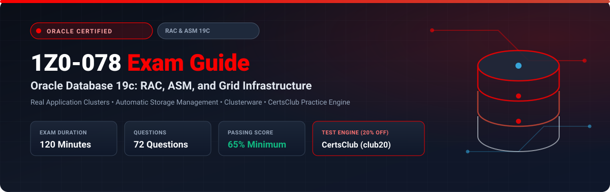

<p align="center">
  
</p>

# Oracle Database 19c: RAC, ASM, and Grid Infrastructure Administration (1Z0-078) Exam Study Guide & Practice Test Resource Portal

[-f80000?style=for-the-badge&logo=oracle&logoColor=white)](https://education.oracle.com/)
[](https://education.oracle.com/)
[](https://education.oracle.com/)
[](https://education.oracle.com/)
[](https://education.oracle.com/)
[-28a745?style=for-the-badge&logo=shield)](https://www.certsclub.com/oracle/)

---

## 1. Exam Overview & Candidate Profile

The **Oracle Database 19c: RAC, ASM, and Grid Infrastructure Administration (1Z0-078)** exam validates technical mastery in designing, deploying, managing, and maintaining Oracle Real Application Clusters (RAC), Automatic Storage Management (ASM), and Oracle Grid Infrastructure (Clusterware). The certification demonstrates that you can configure cluster nodes, administer shared storage and ASM disk groups, optimize Cache Fusion inter-node communication, configure cluster networking (SCAN, VIP, Interconnect), manage dynamic workloads through database services, and resolve complex cluster synchronization issues.

Passing 1Z0-078 earns the **Oracle Certified Specialist, Oracle Database 19c: RAC and Grid Infrastructure Administrator** credential.

### Target Candidate Profile & Career Roles
* **Senior Oracle Database Administrators (RAC DBAs)**
* **High-Availability Infrastructure & Cluster Engineers**
* **Database Platform Architects & System Performance Engineers**
* **Prerequisites:** Prior experience in single-instance Oracle Database 19c administration, shared storage technologies (SAN/NAS/iSCSI), Linux cluster interconnect configurations, and basic shell scripting.

---

## 2. Key Exam Specifications

| Parameter | Official Specification |
| :--- | :--- |
| **Exam Code** | 1Z0-078 |
| **Exam Title** | Oracle Database 19c: RAC, ASM, and Grid Infrastructure Administration |
| **Associated Credential** | Oracle Certified Specialist, Oracle Database 19c: RAC and Grid Infrastructure Administrator |
| **Duration** | 120 Minutes |
| **Number of Questions** | 72 Questions |
| **Passing Score** | 65% |
| **Question Format** | Multiple Choice (Single and Multiple Select) |
| **Delivery Vendor** | Pearson VUE / Oracle University Online Remote Proctoring |
| **Recommended Practice Test Engine** | **[1Z0-078 Practice Test - CertsClub](https://www.certsclub.com/oracle/)** (Coupon: `club20` for 20% off) |

---

## 3. Official Blueprint & Exam Domain Breakdown

| Domain Code | Domain Title | Weighting | Key Competencies Covered |
| :--- | :--- | :---: | :--- |
| **1.0** | **Grid Infrastructure Concepts & Clusterware Architecture** | **20%** | Oracle Clusterware initialization, CSS, CRS, EVM, and CTSS daemons; Oracle Cluster Registry (OCR) and Voting Disks management; Single Client Access Name (SCAN) listeners and Virtual IPs (VIPs); Grid Naming Service (GNS); Node addition and deletion procedures. |
| **2.0** | **Automatic Storage Management (ASM) Administration** | **22%** | ASM instance initialization and parameters; Disk groups, allocation units (AU), and failure groups; Normal, High, and External redundancy; ASM rebalancing operations; Flex and Extended Disk Groups; ASM Cluster File System (ACFS) and ASM Dynamic Volume Manager (ADVM). |
| **3.0** | **RAC Database Architecture & Cache Fusion** | **20%** | Global Cache Service (GCS) and Global Enqueue Service (GES); Cache Fusion block transfer mechanics (CR and Current blocks, Past Images); Private interconnect requirements and jumbo frames; Parameter management in RAC (`SPFILE` parameter scopes). |
| **4.0** | **Workload Management & High Availability Services** | **20%** | Creating and managing database services (`srvctl add service`); Server pools (policy-managed vs administrator-managed databases); Fast Application Notification (FAN) and Transparent Application Failover (TAF); Application Continuity (AC) and Transaction Guard. |
| **5.0** | **RAC & Cluster Troubleshooting and Diagnostics** | **18%** | Cluster Health Monitor (CHM) and Autonomous Health Framework (AHF/TFA); Cluster Verification Utility (`cluvfy`); Resolving split-brain scenarios and voting disk quorums; Node eviction diagnostics; Backing up and recovering OCR and Voting Files. |

---

## 4. Deep Dive into Complex Exam Topics

### 4.1 Cache Fusion Block Transfer Mechanics
Cache Fusion allows data blocks to transfer directly between database instance buffer caches over the high-speed private interconnect without writing to disk:
* **Current Block Request:** When Instance B requires a write lock on a block held by Instance A, Instance A logs changes locally, creates a **Past Image (PI)** block in its cache, and sends the Current block to Instance B over the interconnect.
* **Consistent Read (CR) Block Request:** When Instance B requires a read-consistent snapshot, Instance A constructs the CR block using undo and transmits it directly via private interconnect.
* **Exam Trap:** Disk writes only occur when checkpointed or forced by space pressure, never as an intermediary step during normal Cache Fusion block exchanges.

### 4.2 Voting Disk Quorum and Node Eviction
Voting Disks maintain cluster node membership information and arbitrate split-brain network partitions:
* **Formula:** The cluster requires a strict majority of voting disks to survive:
  $$\text{Quorum Required} = \lfloor N/2 \rfloor + 1$$
* In an ASM disk group with **Normal Redundancy** (3 voting disks across 3 failure groups), at least 2 voting disks must be online.
* If a node cannot contact the majority of voting disks, Oracle Cluster Synchronization Services (OCSS) evicts and reboots that node to prevent database corruption.

---

## 5. Scenario-Based Demo Questions & Technical Explanations

### Question 1: Configuring Application Continuity for Planned Maintenance
**Scenario:** You need to configure an Oracle RAC database service named `REPORTING_SVC` on an administrator-managed database such that client transactions are transparently replayed during unexpected node failures or planned instance relocations without throwing application errors.

Which `srvctl` command accomplishes this with Application Continuity enabled?

A)
```bash
srvctl add service -db proddb -service REPORTING_SVC -preferred proddb1 -available proddb2 -failovertype SELECT -failovermethod BASIC
```

B)
```bash
srvctl add service -db proddb -service REPORTING_SVC -preferred proddb1 -available proddb2 -failovertype TRANSACTION -commit_outcome TRUE -replay_init_time 300
```

C)
```bash
srvctl add service -db proddb -service REPORTING_SVC -preferred proddb1 -available proddb2 -failovertype SESSION -failover_restore AUTO
```

D)
```bash
srvctl add service -db proddb -service REPORTING_SVC -serverpool generic -tafpolicy PRECONNECT
```

**Correct Answer:** **B**

**Detailed Explanation:**
* In Oracle Database 19c, **Application Continuity (AC)** requires configuring the service with `-failovertype TRANSACTION`, `-commit_outcome TRUE`, and setting a valid replay threshold like `-replay_init_time 300`. This enables Transaction Guard to determine if a commit succeeded and allows the driver to replay in-flight uncommitted transactions transparently.
* Option **A** configures legacy Transparent Application Failover (TAF) with `SELECT` failover, which does not replay uncommitted DML transactions.
* Option **C** uses `SESSION` failover, which only reconnects the session without replaying transaction states.
* Option **D** uses deprecated preconnect TAF policies.

---

## 6. Recommended Preparation Strategy & Practice Testing Engine

To pass 1Z0-078 with confidence:

1. **Build a Multi-Node RAC Virtual Lab:** Use Oracle VirtualBox or Vagrant to build a 2-node Oracle RAC cluster on Oracle Linux with shared virtual disks.
2. **Practice Failure Scenarios:** Force node failures, unplug interconnect NICs, simulate ASM disk group failures, and practice OCR restores using `ocrconfig`.
3. **Practice Full-Length Mock Exams:** We strongly recommend **[CertsClub Oracle 1Z0-078 Practice Tests](https://www.certsclub.com/oracle/)**.
   * Evaluates deep conceptual questions on Cache Fusion, voting disk quorums, and SRVCTL commands.
   * Provides real-time timer simulations and detailed answers with official documentation citations.
   * Apply coupon code **`club20`** at checkout on [CertsClub](https://www.certsclub.com/oracle/) for an instant 20% discount.

---

## 7. Official Documentation & References

* [Oracle Real Application Clusters Administration and Deployment Guide 19c](https://docs.oracle.com/en/database/oracle/oracle-database/19/racad/)
* [Oracle Automatic Storage Management Administrator's Guide 19c](https://docs.oracle.com/en/database/oracle/oracle-database/19/ostmg/)
* [CertsClub Oracle 1Z0-078 Practice Engine](https://www.certsclub.com/oracle/)

---

## 8. SEO & Discovery Keywords
```
1z0-078, 1z0-078 dumps, 1z0-078 exam questions, oracle rac 19c exam, 1z0-078 practice test,
oracle grid infrastructure administration, certsclub 1z0-078, cache fusion, voting disks,
asm disk groups, application continuity, srvctl commands
```
